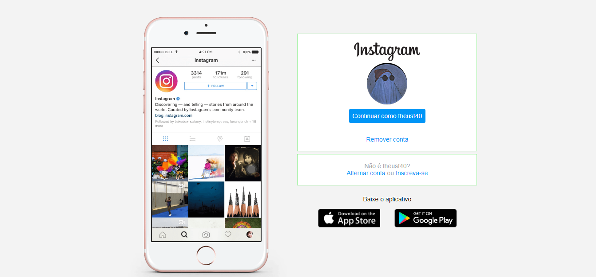
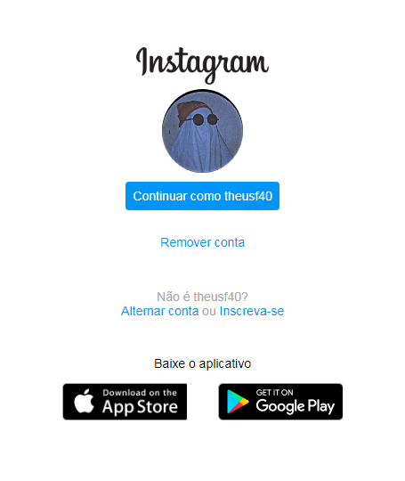

# clone-instagram

## Sobre o projeto

- Projeto feito para passar no desafio de projeto "Recriando a página inicial do Instagram" da [DIO](https://www.dio.me/)
- Clone da interface do Instagram
- Design responsivo para dispositivos móveis

## O que foi praticado neste projeto?

- HTML e CSS
- FlexBox
- Media Queries
- Seletores CSS

## Como está o site?

### Versão para Deskotop

### Versão para mobile

